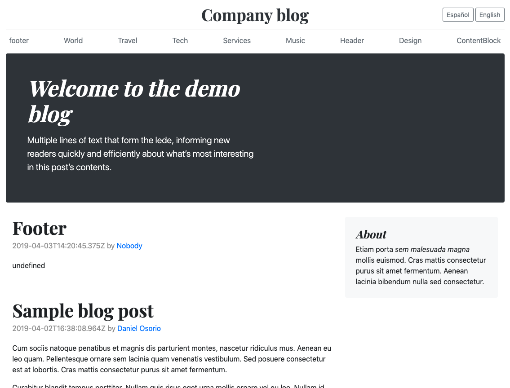

# Contentstack example

Simple example to load Contentstack data using its API

# Run example

Asign the api key and access token of your stack from Contentstack

```javascript
const CONTENTSTACK_API_KEY = ''
const CONTENTSTACK_ACCESS_TOKEN = ''
````

And open the index.html in your browser


